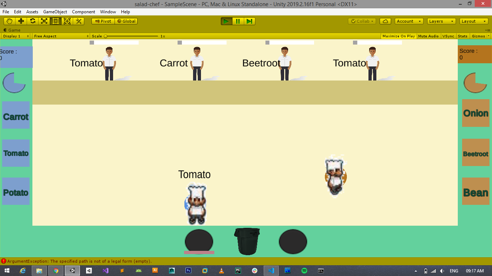

# SALAD CHEF

<table>
  <th>Controls</th>
  <th>Player 1</th>
  <th>Player 2</th>
  <tr>
    <td>Movement</td>
    <td>WASD</td>
    <td>Up, Down, Left, Right Arrows</td>
  </tr>
   <tr>
    <td>Select Potato</td>
    <td>Left CTRL</td>
    <td>Right CTRL</td>
  </tr>
   <tr>
    <td>Select Tomato</td>
    <td>Left SHIFT</td>
    <td>Right SHIFT</td>
  </tr>
   <tr>
    <td>Select Carrot</td>
    <td>CAPS LOCK</td>
    <td>\</td>
  </tr> 
  <tr>
    <td>Select Bean</td>
    <td>Z</td>
    <td>/</td>
  </tr>
   <tr>
    <td>Select Beetroot</td>
    <td>X</td>
    <td>. (Period)</td>
  </tr>
   <tr>
    <td>Select Onion</td>
    <td>C</td>
    <td>, (Comma)</td>
  </tr>
  <tr>
    <td>Start Chopping</td>
    <td>F</td>
    <td>Right ALT (Semicolon)</td>
  </tr>
  <tr>
    <td>Throw to dustbin</td>
    <td>H</td>
    <td>; (Semicolon)</td>
  </tr>
</table>

 
 
  
 
  
 
  
